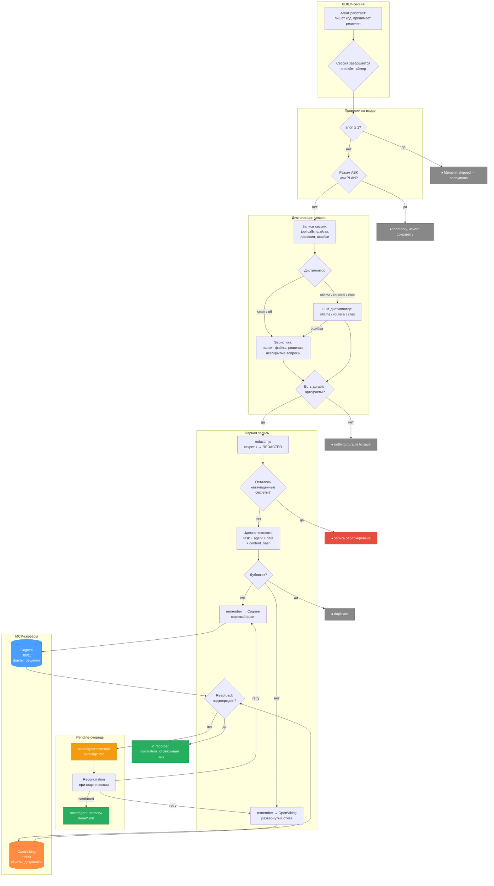

# pi-1c-agent

Профиль [Pi](https://github.com/badlogic/pi-mono) для разработки на **1С:Предприятие**. Ставится в Pi и в Cursor.

Профиль — это правила, команды, скиллы и runtime-пакет, которые учат агента работать с 1С: различать расширение и основную конфигурацию, запрашивать метаданные через MCP вместо выдумывания имён реквизитов, защищать проект от случайных записей в режиме вопросов.

## Что это даёт

**Три режима работы.** ASK — задаёте вопросы, агент читает код и вызывает MCP, но не пишет ни одного файла. PLAN — исследует задачу, выбирает целевой контейнер (расширение или конфигурация), готовит план с файлами и рисками. BUILD — реализует. Переключение: `/mode ask|plan|build` или `Ctrl+Alt+P`. Новая сессия стартует в ASK.

**Инициализация проекта.** `/init` — мастер: пустой каркас или выгрузка из ИБ / `.cf` / `.dt`. Создаёт каталоги (`src/cf`, `src/cfe`, `build/`), `.dev.env` с переменными платформы (пароли остаются только в нём), подключает слой знаний конфигурации `.pi/1c`. Если рядом лежат другие 1С-проекты — подхватит из них PREFIX, DEVELOPER, PLATFORM_PATH. `/init knowledge` сажает только дерево знаний в существующий репозиторий.

**MCP по желанию.** По умолчанию `mcp.json` пустой. Подключение — `/installtools` или отдельные установщики (`/installmcp`, `/install-memory-mcp`). Фрагменты лежат в `mcp.optional/`.

**Vanessa, Конвертация данных, Humanizer — как опции.** Vanessa Automation (сценарные тесты через MCP), КД 2 / КД 3 (правила конвертации через MCP Toolkit по HTTP), Humanizer RU (редактура русского текста) — бета-скиллы в отдельных каталогах. `/init` спрашивает про них; молчание = нет. Они не часть `comol/ai_rules_1c`.

## Память агента

Память opt-in: по умолчанию выключена, MCP-серверов в `mcp.json` нет. Подключается `/install-memory-mcp` или руками через `mcp.optional/memory-stack/`.



Два бэкенда:

| Бэкенд | Что хранит | Примеры |
|---|---|---|
| **Cognee** (`memory`, порт 8001) | Короткие факты, решения, предпочтения, уроки из ошибок | «в проекте X расширение ФСК_ — целевой контейнер», «на этой базе блокировки через РегистрыСведений, не через КонстантыМенеджер» |
| **OpenViking** (`knowledge`, порт 1933) | Развёрнутые отчёты, хендоффы между сессиями, документация, процедуры | Полный отчёт о рефакторинге обмена, протокол настройки КД 3.1, дизайн-ноут по архитектуре расширения |

**Парная запись.** После существенной работы (создал файлы, принял архитектурное решение, исправил дефект) агент пишет пару: короткий факт в Cognee + развёрнутый отчёт в OpenViking. Оба связаны `correlation_id`. Дубликаты не создаются — идемпотентность по `task + agent + date + content_hash`.

**Редакция секретов.** Перед любой записью текст проходит через `redact.mjs`: токены, пароли, API-ключи, приватные ключи, Authorization-заголовки, credentialed DSN заменяются на `[REDACTED:<kind>]`. Если после редакции остался незачищенный секрет — запись блокируется.

**Pending-очередь.** Если MCP-сервер недоступен или запись не подтвердилась при read-back — запись не теряется. Она попадает в `state/agent-memory/pending/` как markdown с YAML-метаданными (idempotency_key, target, correlation_id, status). При следующем старте сессии агент запускает reconciliation: перебирает pending-записи, пробует дослать в MCP, подтверждённые перемещает в `state/agent-memory/done/`.

**Session capture.** В конце BUILD-сессии агент собирает дайджест: какие файлы менялись, какие решения приняты, что осталось незакрытым. Дайджест строится эвристикой по записям сессии или через LLM-дистиллятор (настраивается `/capture-model stack|ollama <model>|chat|off`). Результат — та же парная запись fact + report.

**Анонимный режим.** `/anon 1` — не писать в память. `/anon 2` — не писать и не читать. `/anon 3` — плюс не создавать хендоффы. Для работы с чужим кодом, демонстраций, конфиденциальных задач.

**Approval.** `/approve safe` — агент спрашивает подтверждение перед записью файлов, деструктивным bash, MCP-мутациями в BUILD. `/approve strict` — на каждый tool call. `/approve off` — без подтверждений (по умолчанию).

## Примеры

**Начать проект:**
```
/mode build
/init
```
Мастер спросит: пустой каркас или выгрузка? Платформа, префикс, Vanessa / КД? Соберёт `.dev.env`, создаст каталоги, опционально выгрузит конфигурацию из ИБ.

**Разобраться в чужом коде:**
```
/mode ask
```
Спрашиваете — агент читает исходники, вызывает MCP за метаданными, объясняет. Файлы не меняет.

**Спланировать доработку:**
```
/mode plan
```
Исследует задачу, определяет целевой контейнер по правилам из `rules-1c/`, пишет план с файлами и рисками. Готов — предлагает перейти в BUILD.

**Проверить установку:**
```
/doctor
```
Проверяет пути, пакеты, `settings.json`, MCP. `/doctor-explain` — развёрнутый разбор.

**Обновить:**
```
/update-profile
/update-pi-cli
```
Первая — обновляет клон с `origin`, секреты и MCP не затирает. Вторая — обновляет оболочку Pi в npm-префиксе.

## Что появляется в проекте 1С

Профиль живёт отдельно (`PI_CODING_AGENT_DIR`). В проект 1С он не копируется — `/init` создаёт только данные проекта:

```
my-erp-project/
├── .dev.env                        # переменные платформы, ИБ, пароли (только локально, в .gitignore)
├── USER-RULES.md                   # ваши правила проекта — приоритет выше, чем у агента
├── src/
│   ├── cf/                         # выгрузка основной конфигурации
│   └── cfe/                        # расширения
├── build/                          # собранные .cfe / .cf для переноса
└── .pi/
    └── 1c/
        ├── project.yaml            # имя конфигурации, версия, выбранные опции (без секретов)
        ├── init-state.json         # состояние инициализации
        ├── configuration.json      # привязка к конфигурации
        ├── knowledge/
        │   ├── fingerprint.json    # отпечаток исходников — для отслеживания изменений
        │   └── items/*.json        # факты о конфигурации: «в ЕРП 2.5 остатки — РегистрНакопления.ТоварыНаСкладах»
        ├── knowledge-drafts/       # черновики: /learn создаёт сюда, активация — отдельная команда
        └── rules/
            ├── configuration/      # правила конфигурации: «расширение не должно подписываться на событие ПриЗаписи»
            └── project/            # правила проекта: «все новые объекты — в расширение ФСК_»
```

**Слой знаний** — это не промпт и не текст для модели. Это структурированные JSON-записи с полями `kind`, `scope`, `topic`, `statement`, `confidence`, `evidence`. Агент запрашивает из них только релевантные по задаче/объекту/подсистеме, а не грузит всё в контекст.

**Приоритет:** правила проекта (`USER-RULES.md`, `.pi/1c/rules/project/`) → правила конфигурации → верифицированные факты о конфигурации → базовые `ai_rules_1c`. Выше — сильнее.

**Целевой контейнер.** Перед любой правкой агент проверяет `.dev.env` (`NEW_OBJECTS_IN`, `EXTENSION_NAME`) и правила проекта, чтобы понять: писать в основную конфигурацию или в расширение. Новое расширение — только по явной просьбе, никогда неявно.

**Безопасность.** `/learn` создаёт черновик в `knowledge-drafts/`. Активация — отдельная команда `/config apply` в BUILD. Модель не может втихую добавить себе правило.

## Работа со знаниями и правилами

Знания проекта — не статичный конфиг. Их можно пополнять, анализировать, обновлять при смене версии конфигурации.

### Добавление знаний

**Через `/learn`.** Вы говорите агенту факт или правило:
```
/learn в ЕРП 2.5 остатки товаров лежат в РегистрНакопления.ТоварыНаСкладах
```
Агент классифицирует (fact / rule / preference / assumption), определяет scope (configuration / project), ищет evidence в исходниках и создаёт **черновик** в `.pi/1c/knowledge-drafts/`. Ничего не активируется. `/learn` без аргумента открывает меню: создать факт, одобрить черновик или отклонить.

**Через `/rule add`.** Прямое добавление правила:
```
/rule add project :: extensions :: все новые объекты создаём в расширении ФСК_
```
Тоже черновик. Тоже требует одобрения.

**Активация.** Только в BUILD:
```
/learn approve
```
Открывает список pending-черновиков, выбираете — он становится активным. Или по id: `/learn approve <id>`. Отклонение: `/learn reject`.

### Анализ конфигурации

`/config analyze` — PLAN-only. Агент читает исходники, метаданные, общие модули и предлагает набор фактов и правил:
```
/mode plan
/config analyze архитектура, подсистемы, обмены
```
Результат — черновик с десятком-другим предложений (facts + rules), каждое с evidence. Активация — в BUILD через `/config apply`.

### Обновление при смене версии

Конфигурация обновилась с ЕРП 2.5.25 на 2.5.28? `/config update` сравнивает fingerprint исходников, находит изменённые пути и предлагает:
- **invalidate** — факты, чьи evidence пересекаются с изменёнными файлами;
- **update** — уточнённые формулировки;
- **add** — новые факты о появившихся механизмах.

```
/mode plan
/config update 2.5.28
```

Черновик → ревью → `/config apply` в BUILD. Fingerprint обновляется только после одобрения.

### Аудит и конфликты

```
/rule audit           # общий аудит: stale items, counts
/rule conflicts       # конфликты между слоями (проект vs конфигурация)
/rule list            # все активные правила
/rule list project    # только проектные
/rule show <id>       # детали конкретного правила/факта
/rule disable <id>    # деактивировать (BUILD)
```

### Как агент использует знания

Перед каждой нетривиальной задачей агент вызывает `knowledge_1c` с запросом по теме. Например, задача «добавить печатную форму в документ Реализация» → запрос по topic=печатные формы, object=Реализация. Возвращаются только релевантные записи, ранжированные по приоритету. Если знаний нет — агент опирается на базовые `ai_rules_1c` и исходники, а не выдумывает правила.

## Установка

Работает на Windows, Linux и macOS. Каталог — там, куда клонируете.

1. Клонируйте и задайте переменную:

   ```bash
   git clone https://github.com/z03ps00/pi-1c-agent.git ~/pi-1c-agent
   export PI_CODING_AGENT_DIR=~/pi-1c-agent
   ```

2. Первый запуск (прописывает пакет в `settings.json`, копирует примеры `auth.json` / `trust.json`):

   ```bash
   node "$PI_CODING_AGENT_DIR/scripts/setup.mjs"
   ```

   Windows: `node "%PI_CODING_AGENT_DIR%\scripts\setup.mjs"`. Повторный запуск безопасен.

3. По желанию — провайдер Cursor SDK и отрисовка инструментов:

   ```bash
   PI_CODING_AGENT_DIR=<clone> pi install npm:pi-cursor-sdk
   PI_CODING_AGENT_DIR=<clone> pi install npm:pi-tool-display
   ```

4. MCP: `/installtools`. Память: `/install-memory-mcp`.
5. Проверка: `/doctor`.
6. Обновление: `/update-profile` (профиль), `/update-pi-cli` (оболочка Pi).

Секреты — только локально: `auth.json`, `trust.json`. Пароли ИБ — в `.dev.env` проекта, не здесь.

Подробности: [`AGENTS.md`](AGENTS.md). OAuth MCP: [`MCP-OAUTH.md`](MCP-OAUTH.md).

## Что внутри

| Путь | Что делает |
|---|---|
| `AGENTS.md` | Главные правила агента: режимы, MCP, Docker, память |
| `rules-1c/` | Адаптированные правила 1С (upstream `comol/ai_rules_1c` + оверлей) |
| `agents/`, `skills/`, `prompts/` | Субагенты, скиллы, шаблоны команд |
| `packages/pi-1c-agent/` | Runtime: `/init`, `/doctor`, `/mode`, `/anon`, `/wrap`, `/session-rotate` |
| `scripts/` | Установка, обновление, проверка перед публикацией |
| `mcp.json`, `mcp.optional/` | Пустой дефолт + фрагменты для подключения серверов |
| `state/agent-memory/` | Pending-очередь и история подтверждённых записей |

## Лицензия и благодарности

Оригинальная работа — [MIT](LICENSE).

Сторонний материал оставлен в дереве и не перелицензируется. Спасибо авторам:

- [comol/ai_rules_1c](https://github.com/comol/ai_rules_1c) — правила 1С (условия — в README upstream);
- [Desko77/cursor-1c-skills](https://github.com/Desko77/cursor-1c-skills) — MIT, основа lab extras;
- [comol/Humanizer_RU](https://github.com/comol/Humanizer_RU) — MIT;
- Vanessa Automation (Pr-Mex), neurofish `client_mcp.cfe`, ROCTUP `MCP_Toolkit.epf` — сторонние продукты, на которые опираются extras.

Полная граница лицензий: [`NOTICE`](NOTICE).
